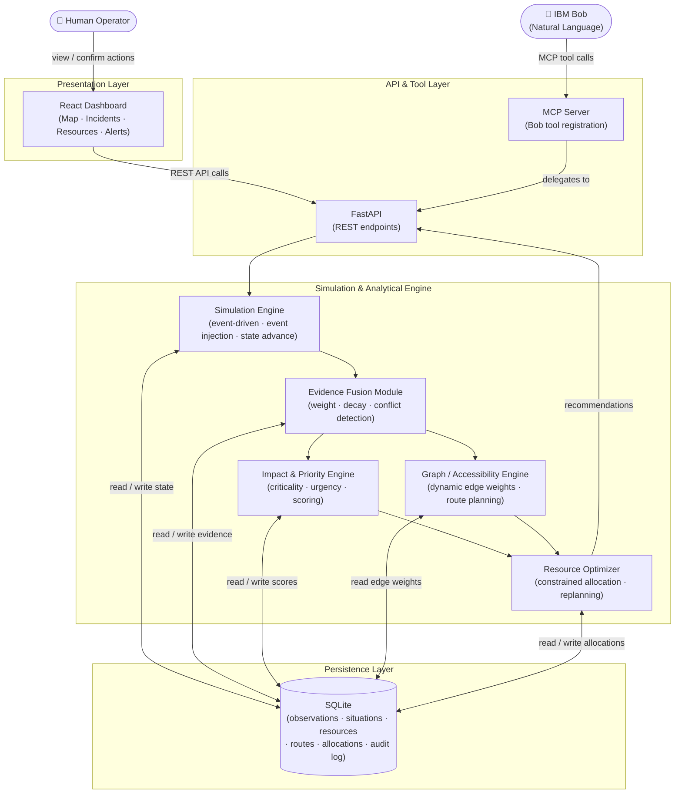

# Architecture: AI Emergency Operations & Resource Orchestration System

## Overview

The system is composed of five functional layers: a presentation layer (React dashboard + IBM Bob), an API and tool-exposure layer (FastAPI + MCP server), a simulation and analytical engine (Python, modular), a persistence layer (SQLite), and an evidence/reasoning subsystem that spans the engine layer. Each layer has a clearly defined responsibility and a well-defined interface with its neighbors.

---

## System Diagram



---

## Component Responsibilities

### React Dashboard

The dashboard renders the current situation model as an interactive map (village markers sized and colored by priority score), an incident feed sorted by priority, a resource roster with current assignment status, and a live alert panel. All data is fetched from the FastAPI backend via polling (every 5 seconds).

The dashboard surfaces optimizer recommendations as actionable cards — each card shows the recommended action, the rationale, the priority score, and a confidence indicator. Operators click **Confirm** or **Reject** on each card; neither action is performed automatically.

### FastAPI + MCP Layer

FastAPI serves as the single backend entry point for both the dashboard and IBM Bob. It exposes the following REST endpoints:

- `GET /health` — health check with simulation time and counts
- `GET /scenario` — active scenario identity (name, type, geography, entity counts) plus live simulation progress
- `GET /situation` — current situation overview (priorities, blocked infra, conflicts, plan)
- `GET /entities` — all assets, roads, and bridges
- `GET /entities/{id}` — single entity with evidence and priority data
- `GET /evidence/{entity_id}` — all evidence (fused + raw) for an entity
- `GET /priorities` — priority-ranked list of all entities
- `GET /resources` — all resources with current status
- `GET /routes?origin=X&destination=Y&vehicle_type=Z` — calculate feasible route
- `POST /routes` — same route calculation with a JSON body
- `POST /simulate/next` — process the next simulation event
- `POST /simulate/auto` — process all remaining events
- `POST /simulate/event` — inject a custom event
- `POST /simulate/reset` — reset simulation to initial state
- `POST /optimize` — trigger resource optimization (AI + baseline comparison)
- `GET /decisions` — decisions with explanations; supports `current_only` and `task_id` filters
- `GET /decisions/{id}` — single decision with AI explanation
- `POST /decisions/{id}/confirm` — record an operator's accept / reject / modified response
- `GET /benchmark` — run benchmark (AI vs baseline)
- `GET /timeline` — full simulation timeline
- `GET /map-data` — GeoJSON map data for the frontend
- `POST /ai/question` — natural-language operator Q&A
- `GET /ai/situation` — generated situation brief derived from actual state
- `GET /audit` — audit log entries (persisted rows unioned with the in-session log)
- `GET /tasks` — all current tasks
- `GET /plan` — current response plan

The MCP server wraps a subset of these endpoints as registered Bob tools via HTTP calls to the FastAPI backend. Bob resolves intent, selects the appropriate tool, calls the corresponding endpoint, and formats the response as readable prose with key metrics highlighted.

### Simulation Engine

The simulation engine drives the Bhote Valley scenario as a **discrete event-driven
process — there is no tick loop or background timer.** Nothing advances unless a
caller asks it to. `POST /simulate/next` pops the next unprocessed event and jumps
the simulated clock straight to that event's `time_offset_min`; the scheduled
Nepal sequence happens to be spaced 15 minutes apart (T+0 through T+180), which is
a property of the scenario data, not of a fixed interval in the engine.

Processing one event runs this pipeline, in order:

1. Creates an `Observation` from the event and persists it to SQLite
2. Applies any direct state change (bridge/road status, resource availability,
   asset status) and writes an audit record
3. Re-fuses **all** observations for every entity, recomputing weights, freshness
   and conflict flags
4. Recalculates priority scores for every scored asset
5. Regenerates the task set from scratch (task ids are deterministic:
   `TASK-{asset_id}-{task_type}`)
6. Re-runs the resource optimizer, producing a new `ResponsePlan` and inserting a
   new generation of decision rows
7. Diffs the new plan against the pre-event snapshot to produce `plan_changes`

Note that steps 3–5 are full recomputations rather than incremental updates, and
that fused evidence, priorities, tasks and plans are held in memory only — they
are rebuilt every cycle. Only entities, observations, decisions and sim events are
persisted.

The engine also supports **manual event injection** via `POST /simulate/event`,
which runs the identical pipeline. Injected events are persisted with an
`EVT-INJ-*` id and deliberately survive a reset, so they are replayed on the next
run-through.

### Evidence Fusion Module

This is the epistemic core of the system. For each subject (a location, a road segment, a bridge, a population estimate), the module maintains a set of observations and computes a fused evidence record.

**Freshness decay:**
```
freshness(obs) = exp(-λ × age_hours)
```
Where λ (lambda) is the decay rate parameter, configurable per observation category:

λ is keyed on the observation type. These are the values actually configured in
`app/config.py` (`freshness_lambda_*`):

| Observation type | λ per hour | Half-life |
|---|---|---|
| `flood_level` | 3.0 | ~14 minutes |
| `bridge_status` | 2.0 | ~21 minutes |
| `capacity` (hospital load) | 2.0 | ~21 minutes |
| `road_status` | 1.5 | ~28 minutes |
| `structural` | 0.5 | ~83 minutes |
| `population` | 0.1 | ~6.9 hours |
| anything else (default) | 1.0 | ~42 minutes |

The short half-lives are deliberate: a bridge report goes stale fast, a population
count does not.

**Evidence weight:**
```
weight(obs) = source_reliability × confidence × freshness
```
Source reliability is a per-source-type baseline, configured in `app/config.py`
(`reliability_*`): simulation 1.00, hospital 0.95, authority_report 0.92, drone
0.90, field_report 0.88, satellite 0.85, school 0.85, sensor 0.80, emergency_call
0.75, and 0.70 for any unrecognised source. Confidence is the value carried on the
observation itself.

**Conflict detection:** observations are grouped by *normalized* value — the
canonical category a raw string maps to, so `"collapsed"`, `"impassable"` and
`"blocked"` all count as the same claim. The fused best value is the group with the
greatest total weight. A conflict is flagged when the **second** strongest group
holds at least `conflict_weight_difference_threshold` (default 0.3) of the *total*
evidence weight. It is a share-of-support test, not a numeric difference between
two fused values.

When a conflict is flagged the summary records the supporting observations (the
winning group) and the conflicting observations (the runner-up group) separately,
carries a reduced confidence, and attaches a recommendation to seek field
verification before dispatching.

Worked example from the Nepal scenario — bridge B1, measured at T+45:

| Observation | Source | Confidence | Freshness | Weight |
|---|---|---|---|---|
| `partially_blocked` (EVT-003, T+30) | field_report (0.88) | 0.82 | 0.6065 | **0.4377** |
| `open` (EVT-004, T+45) | field_report (0.88) | 0.50 | 1.0000 | **0.4400** |

The two reports normalize to **different** categories, so this is one supporting
observation and one conflicting observation with `source_count = 2` — not two
supporting observations. Total weight is 0.8777, giving support shares of 0.4987
and 0.5013: a margin of 0.26 percentage points. The summary is correctly flagged
`conflicting` with a `very_low` confidence of 0.2206.

Which value wins here is genuinely marginal and would flip under any change to λ,
source reliability or event timing. That is the honest characteristic of the
example: it demonstrates that the system *detects and surfaces* the contradiction
rather than resolving it confidently, which is why the recommendation is to verify
in the field.

### Impact & Priority Engine

Receives fused evidence records and computes two scores per location.

**Criticality score** (intrinsic severity, independent of operational factors):
```
criticality = 0.25 × population_score
            + 0.25 × service_need_score
            + 0.20 × time_sensitivity_score
            + 0.15 × isolation_score
            + 0.15 × damage_severity_score
```

**Priority score** (operational decision weight, including what we can do):
```
priority = 0.30 × criticality
         + 0.25 × urgency_score
         + 0.20 × impact_score
         + 0.15 × accessibility_score
         + 0.10 × confidence_score
```

All input scores are normalized to [0, 1]. The distinction between criticality and priority is deliberate: a location may be critically affected (high criticality) but temporarily deprioritized because all access routes are below confidence threshold (low accessibility). The priority score reflects what we should do *now*; criticality reflects the underlying need.

### Graph / Accessibility Engine

Models the road and trail network as a directed graph G = (V, E). Each edge carries:

- **Base travel time** — the expected transit time under normal conditions
- **Accessibility probability** — currently `p(e) ∈ [0, 1]`, derived from fused evidence for that edge's road segments and associated infrastructure
- **Effective weight** — `base_time / p(e)` (lower accessibility inflates effective cost)

Route queries specify an origin, destination, and minimum confidence threshold. The engine runs a modified Dijkstra search that prunes edges below the threshold and returns the top-3 routes ranked by effective cost, along with per-segment confidence and the evidence records that produced each accessibility score.

When edge accessibility changes (due to new evidence), the engine recomputes edge weights and recalculates routes as needed. Affected allocations are flagged for potential replanning.

### Resource Optimizer

Formulates a linear assignment problem: given a set of available resources (typed) and a set of unserved high-priority incidents (typed), find the assignment that maximizes total priority-weighted impact subject to:

- Resource-to-incident type compatibility
- Route accessibility threshold constraints
- Travel time feasibility (resource must be able to arrive within incident time window)
- Capacity constraints (each resource serves one incident at a time)

The optimizer does not produce hard assignments — it produces **allocation recommendations** with explicit rationale. These are surfaced to operators via the dashboard and Bob. The recommendations are logged as decisions and fed back into the situation model for future replanning cycles.

### SQLite Persistence

All state is persisted to SQLite across several primary tables: `assets`, `roads`, `bridges`, `resources`, `observations`, `audit_log`, `decisions`, and `sim_events`. The audit log records every significant state change with timestamp, entity, previous state, new state, and reason. This supports post-incident review.

---

## AI vs. Deterministic Boundary

A key design decision is the explicit boundary between AI-assisted and deterministic components:

| Component | Type | Rationale |
|---|---|---|
| IBM Bob (intent parsing, prose generation) | AI (LLM) | Natural language is LLM's native domain |
| Evidence fusion weights | Deterministic (formula) | Must be auditable; formula is traceable |
| Priority scoring | Deterministic (formula) | Reproducible; parameters are domain-tunable |
| Route planning | Deterministic (graph algorithm) | Correct by construction; fast |
| Resource optimization | Deterministic (LP/assignment) | Optimal by definition given inputs |
| Conflict detection | Deterministic (threshold) | Consistent; no hallucination risk |

Evidence quality assessment and scoring are **never delegated to the LLM**. Bob's role is interface translation: turning natural language into structured API calls and turning structured API responses into readable prose. The analytical engine is deterministic, auditable, and reproducible.

---

## Data Flow Summary

1. A caller invokes `POST /simulate/next` (or `POST /simulate/event`) → the next
   event is applied and its observation is written to SQLite
2. Evidence Fusion re-fuses all observations, recomputing weights, freshness and
   fused values, and flagging conflicts. Fused summaries are held in memory
3. Priority Engine recomputes criticality and priority for every scored asset,
   also in memory
4. Graph Engine edge weights are updated in place when a road or bridge status
   changes; routes are recomputed on demand by the optimizer
5. Optimizer reads current priorities, resources and graph state, generates the
   new recommendation set, and inserts a new generation of `decisions` rows
6. The new plan is diffed against the pre-event snapshot to produce `plan_changes`
   and `affected_decision_ids`, returned on the same response
7. FastAPI exposes current state via REST. **The dashboard polls; there is no SSE
   stream or WebSocket** — push transport is deliberately out of scope
8. Bob tool calls arrive via MCP → FastAPI → returns structured data → Bob formats
   and presents to the operator
9. The operator accepts or rejects a recommendation via
   `POST /decisions/{decision_id}/confirm` → `operator_status` and
   `operator_notes` are written to that decision row and an audit record with
   `event_type=operator_decision` is written to `audit_log`

Two things step 9 deliberately does **not** do: it does not alter the stored
recommendation (the system's advice and the human's response are kept separately),
and it does not dispatch anything. Autonomous dispatch is out of scope, so
`human_verification_required` is always true and acting on a confirmed decision
remains a human activity outside this system.
